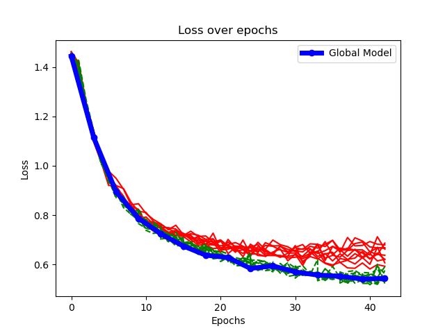
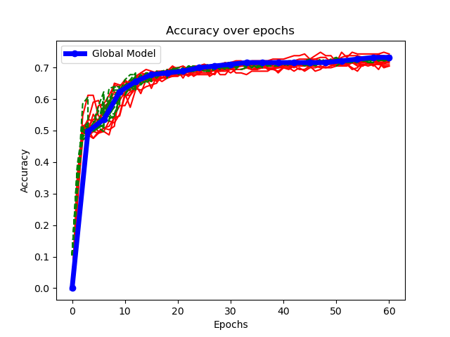
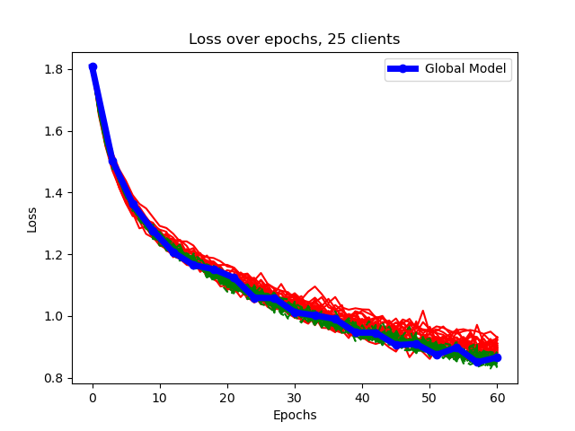
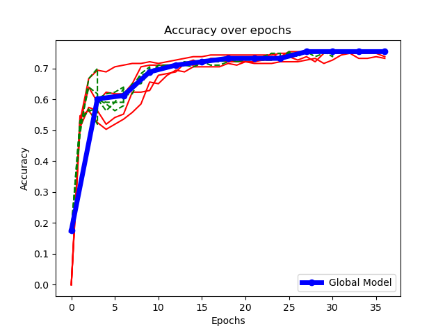
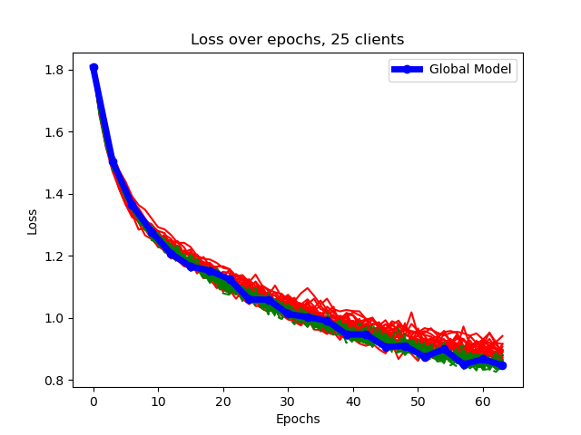
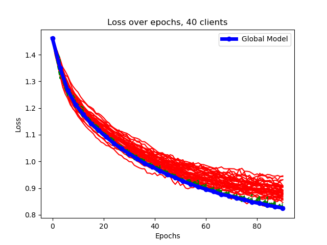
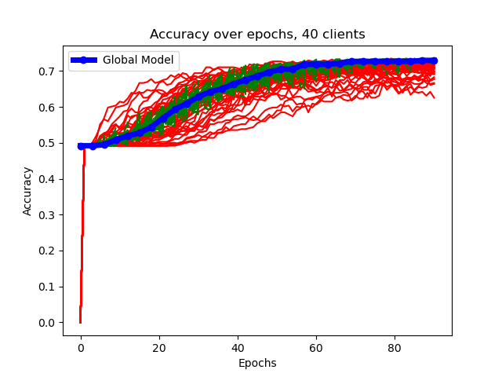

# Diabetic Retinopathy
### RESULTS FedAVG:
 

### RESULTS SCAFFOLD

### To improve yet:
- [ ] Check results without using pre-trained model
- [ ] Check if possible to run SCAFFOLD using Adam optimizer
- [ ] Find best Learning Rate
- [ ] Compare how many independent models are getting better results than the global model each round
- [ ] Get FedAVG results using Adam optimizer
- [ ] Freeze some layers and compare results
- [ ] Use more epochs per round